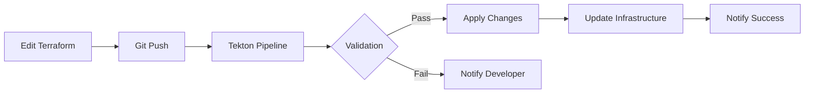
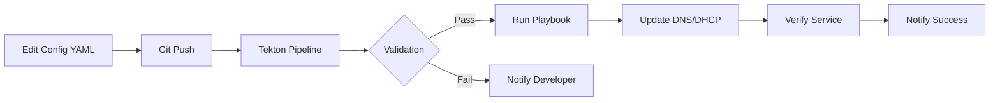
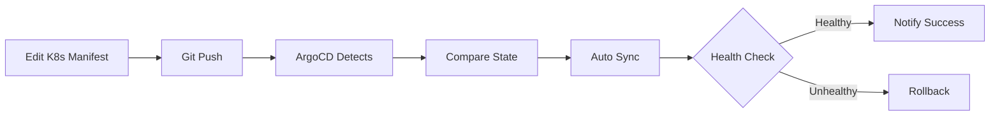

# CI/CD Pipeline for Monger Homelab

## 🚀 Quick Start

This homelab now includes enterprise-grade CI/CD using **ArgoCD** (GitOps) and **Tekton** (CI pipelines).

### What's New?

```
┌─────────────────────────────────────────────────────┐
│  YOU (Developer Machine)                            │
│  • Edit Terraform/Ansible                           │
│  • Git push                                         │
└──────────────────┬──────────────────────────────────┘
                   │
                   ▼
┌─────────────────────────────────────────────────────┐
│  GitHub                                             │
│  • Triggers webhook                                 │
└──────────────────┬──────────────────────────────────┘
                   │
         ┌─────────┴─────────┐
         ▼                   ▼
   ┌──────────┐        ┌──────────┐
   │  Tekton  │        │  ArgoCD  │
   │  (Test)  │        │ (Deploy) │
   └──────────┘        └──────────┘
         │                   │
         └─────────┬─────────┘
                   ▼
         ┌──────────────────┐
         │  K3s Cluster      │
         │  • Applications   │
         │  • Monitoring     │
         └──────────────────┘
```

### Benefits Over Manual Deployment

| Before | After |
|--------|-------|
| Manual `terraform apply` | Automated on git push |
| Manual `ansible-playbook` run | Triggered by pipeline |
| No validation | Automatic syntax checking |
| No rollback | Easy rollback via ArgoCD |
| No audit trail | Full history in Git + K8s |
| No monitoring | Prometheus + Grafana |

---

## 📁 New Directory Structure

```
monger-homelab/
├── argocd/                         # ⭐ NEW: ArgoCD GitOps config
│   ├── applications/               # Application definitions
│   │   ├── argocd-apps.yaml       # Root app (app-of-apps pattern)
│   │   └── monitoring-stack.yaml  # Prometheus + Grafana
│   └── projects/                   # ArgoCD project definitions
│       └── infrastructure.yaml     # Infrastructure project config
│
├── tekton/                         # ⭐ NEW: Tekton CI pipelines
│   ├── pipelines/                  # Pipeline definitions
│   │   └── infrastructure-validation.yaml
│   ├── tasks/                      # Reusable tasks
│   │   ├── terraform-validate.yaml
│   │   └── ansible-validate.yaml
│   └── triggers/                   # Webhook triggers (optional)
│
├── k8s/                            # ⭐ NEW: Kubernetes manifests
│   ├── base/                       # Base configurations
│   └── overlays/                   # Environment-specific overlays
│       ├── dev/
│       └── prod/
│
├── docs/                           # 📄 Documentation
│   ├── CI_CD_STRATEGY.md          # ⭐ NEW: Complete CI/CD strategy
│   └── IMPLEMENTATION_GUIDE.md    # ⭐ NEW: Step-by-step guide
│
├── terraform/                      # Existing infrastructure
├── playbook/                       # Existing Ansible playbooks
├── config/                         # Existing configurations
└── inventory/                      # Existing inventory
```

---

## 🎯 Three Ways to Deploy

### Option 1: Manual (Current - Still Works)

```bash
# Traditional way - still supported
cd terraform
terraform apply

cd ../playbook
ansible-playbook -i ../inventory/raclette/inventory.ini technitium_dns.yml
```

### Option 2: CI Pipeline (Recommended)

```bash
# Make changes
vim terraform/main.tf

# Commit and push
git add .
git commit -m "feat: add new VM"
git push origin main

# Pipeline automatically:
# 1. Validates Terraform
# 2. Validates Ansible
# 3. Runs tests
# 4. Applies changes (if configured)
```

### Option 3: GitOps with ArgoCD (Enterprise)

```bash
# Make changes
vim k8s/monitoring/values.yaml

# Commit and push
git add .
git commit -m "feat: update monitoring config"
git push origin main

# ArgoCD automatically:
# 1. Detects changes
# 2. Syncs to cluster
# 3. Reports health status
```

---

## 🏗️ Implementation Status

### ✅ Created Files

#### Documentation
- [x] `docs/CI_CD_STRATEGY.md` - Complete strategy document
- [x] `docs/IMPLEMENTATION_GUIDE.md` - Step-by-step guide
- [x] `CICD_README.md` - This file

#### ArgoCD Configuration
- [x] `argocd/projects/infrastructure.yaml` - Infrastructure project
- [x] `argocd/applications/argocd-apps.yaml` - App-of-apps root
- [x] `argocd/applications/monitoring-stack.yaml` - Monitoring setup

#### Tekton Pipelines
- [x] `tekton/tasks/terraform-validate.yaml` - Terraform validation
- [x] `tekton/tasks/ansible-validate.yaml` - Ansible validation
- [x] `tekton/pipelines/infrastructure-validation.yaml` - Full pipeline

#### Directory Structure
- [x] Created `argocd/`, `tekton/`, `k8s/` directories

### ⬜ Pending Actions (Your Next Steps)

1. **Deploy K3s Cluster** (if not already done)
   - Review: `terraform/k3s.tfvars`
   - Deploy VMs via Terraform
   - Install K3s using k3s-ansible

2. **Install ArgoCD**
   - Follow: `docs/IMPLEMENTATION_GUIDE.md` Phase 2
   - Access UI and change admin password
   - Configure Git repository

3. **Install Tekton**
   - Follow: `docs/IMPLEMENTATION_GUIDE.md` Phase 3
   - Deploy tasks and pipelines
   - Test pipeline execution

4. **Deploy Monitoring**
   - Via ArgoCD app-of-apps pattern
   - Access Grafana dashboards
   - Configure alerts

5. **Setup Webhooks** (optional)
   - Configure GitHub webhook
   - Test automated pipeline triggers

---

## 📊 What You Get

### Monitoring Stack (via ArgoCD)

- **Prometheus** - Metrics collection
  - Proxmox metrics
  - DNS server metrics
  - K8s cluster metrics
  
- **Grafana** - Dashboards
  - Pre-configured dashboards for Proxmox, DNS
  - Custom homelab dashboards
  
- **Loki** - Log aggregation
  - Centralized logging
  - Log queries and alerts
  
- **AlertManager** - Alerting
  - Slack/Discord notifications
  - Email alerts

### CI/CD Capabilities

- **Terraform Validation**
  - `terraform fmt -check`
  - `terraform validate`
  - `terraform plan` (dry-run)

- **Ansible Validation**
  - YAML linting
  - Syntax checking
  - ansible-lint rules

- **Automated Deployment**
  - Git-based deployments
  - Automatic rollback on failure
  - Deployment history

- **GitOps**
  - Desired state in Git
  - Auto-sync to cluster
  - Drift detection

---

## 🔐 Security Considerations

### Secrets Management

**Current State**: Secrets in `terraform/vars.tf` (plaintext)

**Recommended**: Use External Secrets Operator

```yaml
# Example: External Secret referencing Bitwarden
apiVersion: external-secrets.io/v1beta1
kind: ExternalSecret
metadata:
  name: proxmox-credentials
spec:
  secretStoreRef:
    name: bitwarden-store
  target:
    name: proxmox-creds
  data:
    - secretKey: api-token
      remoteRef:
        key: proxmox-api-token
```

### Access Control

- **ArgoCD RBAC** - Control who can deploy what
- **Tekton ServiceAccounts** - Limited permissions for pipelines
- **K8s RBAC** - Namespace isolation

---

## 🚦 Deployment Workflows

### Workflow 1: Infrastructure Change (Terraform)



### Workflow 2: Configuration Change (Ansible)



### Workflow 3: Application Deployment (K8s)



---

## 📈 Metrics and Monitoring

### Infrastructure Metrics

- **Proxmox**
  - CPU/Memory utilization
  - VM status
  - Storage usage

- **DNS/DHCP**
  - Query rate
  - Lease count
  - Service health

- **K3s Cluster**
  - Node health
  - Pod status
  - Resource usage

### Pipeline Metrics

- **Deployment Frequency** - How often you deploy
- **Lead Time** - Time from commit to production
- **MTTR** - Mean time to recover from failures
- **Change Failure Rate** - Percentage of failed deployments

---

## 🎓 Learning Resources

### Tutorials to Follow

1. **ArgoCD Getting Started**
   - https://argo-cd.readthedocs.io/en/stable/getting_started/

2. **Tekton Tutorial**
   - https://tekton.dev/docs/tutorial/

3. **K3s Documentation**
   - https://docs.k3s.io/

4. **Prometheus + Grafana**
   - https://prometheus.io/docs/tutorials/getting_started/
   - https://grafana.com/tutorials/

### Example Homelab Projects

- **awesome-home-kubernetes**
  - https://github.com/k8s-at-home/awesome-home-kubernetes

- **homelab-gitops**
  - Search GitHub for "homelab gitops" for real examples

---

## 🆘 Getting Help

### Common Issues

**Q: K3s cluster not starting**
A: Check VM resources (RAM/CPU), verify cloud-init completed, check network connectivity

**Q: ArgoCD app stuck in "Progressing"**
A: Check pod logs, verify image pull secrets, check resource limits

**Q: Tekton pipeline failing on validation**
A: Check pipeline logs with `tkn pipelinerun logs`, verify workspace mounts

**Q: Monitoring not showing metrics**
A: Verify service endpoints, check Prometheus targets, verify network policies

### Support Channels

- **Homelab Discord/Reddit** - Community support
- **GitHub Issues** - For bugs in this repo
- **K8s Slack** - #k3s, #argocd, #tekton channels

---

## 🔮 Future Enhancements

### Short Term (1-3 months)
- [ ] Automated secret rotation
- [ ] Multi-environment support (dev/staging/prod)
- [ ] Custom Grafana dashboards for homelab
- [ ] Automated backup testing

### Long Term (3-6 months)
- [ ] Service mesh (Istio/Linkerd)
- [ ] Advanced monitoring (Thanos for long-term metrics)
- [ ] Disaster recovery automation
- [ ] Cost optimization tracking

---

## 📝 Contributing

When making changes to CI/CD configuration:

1. Update documentation if changing workflows
2. Test pipelines before committing
3. Use conventional commits: `feat:`, `fix:`, `docs:`
4. Tag releases for production deployments

---

## 📞 Questions?

Read the detailed guides:
- **Strategy**: `docs/CI_CD_STRATEGY.md`
- **Implementation**: `docs/IMPLEMENTATION_GUIDE.md`

Or check existing documentation:
- **DNS Setup**: `terraform/DNS_DEPLOYMENT.md`
- **Automation**: `AUTOMATION_STRATEGY.md`
- **Backups**: `playbook/README_BACKUP_RESTORE.md`

---

**Status**: 🚧 Ready for Implementation  
**Next Step**: Deploy K3s cluster (see `docs/IMPLEMENTATION_GUIDE.md`)  
**Estimated Time**: 4-6 hours for full setup  
**Difficulty**: Intermediate to Advanced
